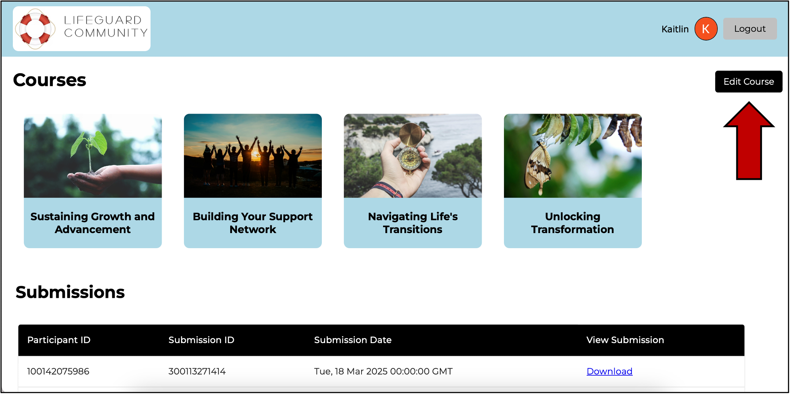
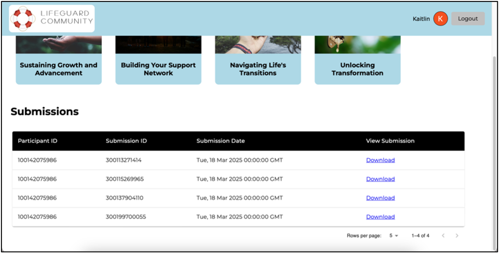
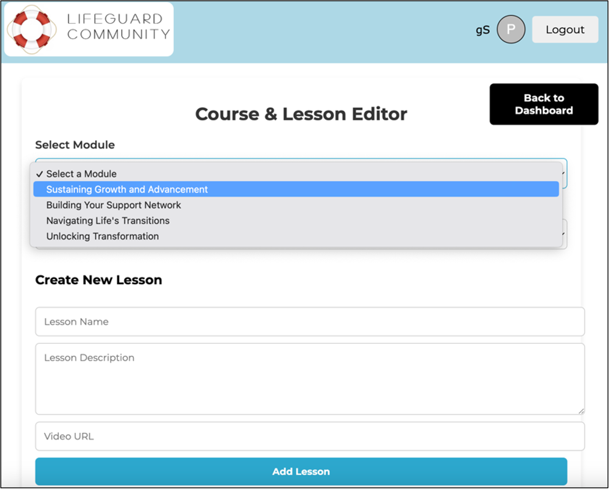
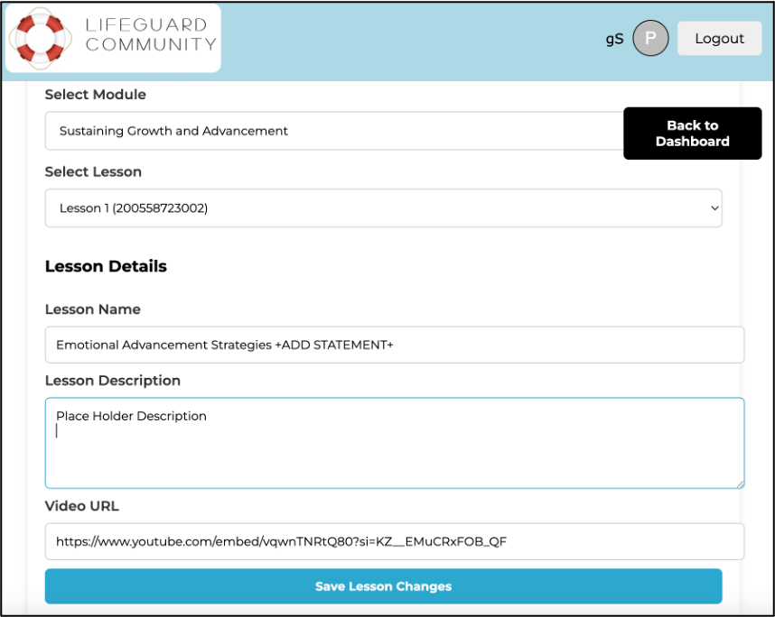
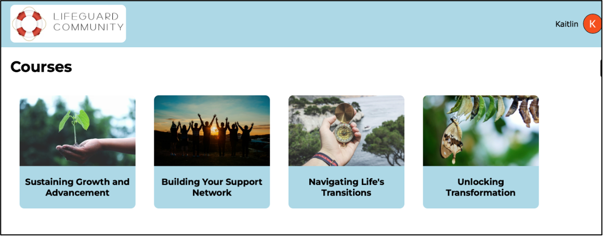
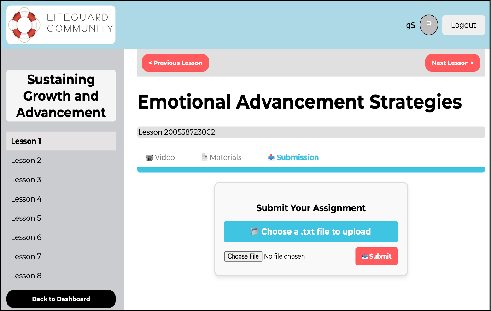
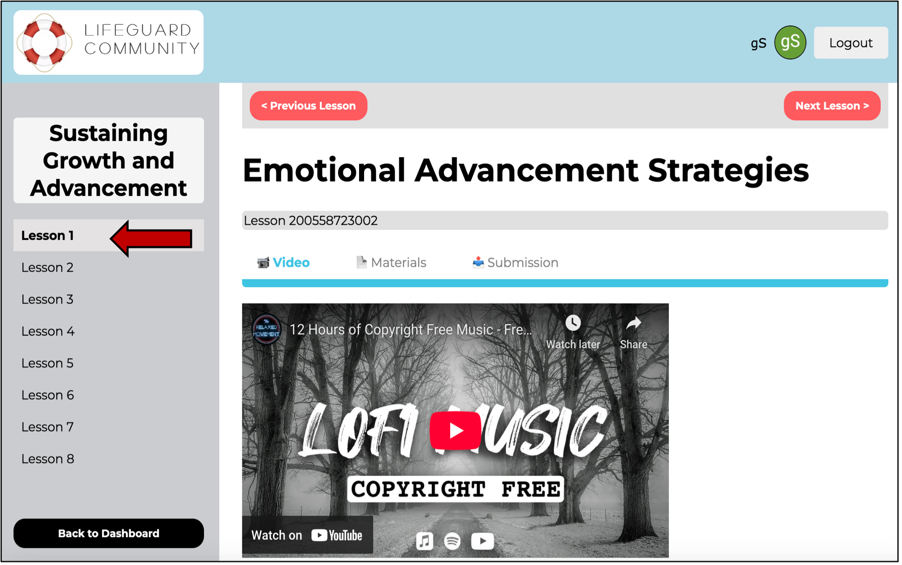

# 🛟 Lifeguard Community Web Application (Capstone)

This capstone project was developed for the Lifeguard Community, a nonprofit that supports individuals recently released from jail or prison. The application connects participants with mentors and provides a structured course platform to support reentry into society.

## Features
- Secure participant login
- Module & lesson system with video, reading materials, and assignments
- Admin dashboard to view user progress and submissions

## Technologies
- React (frontend)
- Node.js & Express (backend)
- MongoDB (database)
- Tailwind CSS (styling)
- GitHub Projects (agile workflow)

## My Role
- Product Owner and Frontend Developer  
- Designed and built the individual participant view page for admins  
- Led sprint planning and client meetings
- Communicated technical terms to non-technical stakeholders
- Created the lesson editor form using responsive flexbox layout  

## Files Included
- 
- 
- 
- 
- 
- 
- 

## Outcome
The application improves access to mentorship, streamlines workshop coordination, and offers structured digital support for successful reentry. The project was delivered through agile sprints over a 10-week period in collaboration with a real nonprofit client. 

